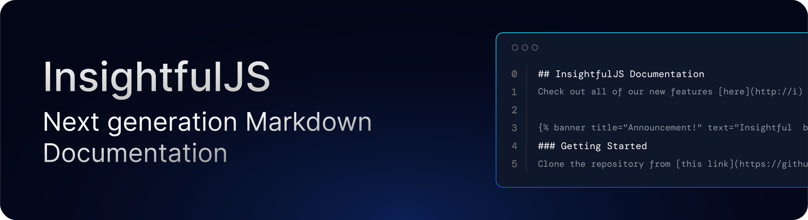

[](http://commitizen.github.io/cz-cli/)

## Getting Started

To get started, run the following:

```bash
pnpm i
```

Run the development environment with:

```bash
pnpm dev
```

The [open in your local browser](http://localhost:3000).
